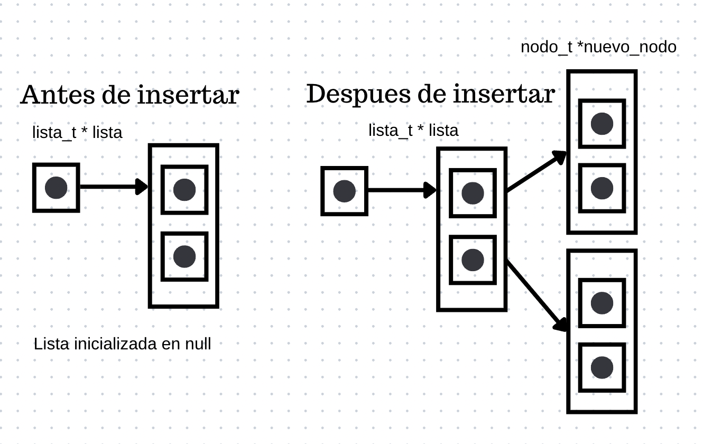
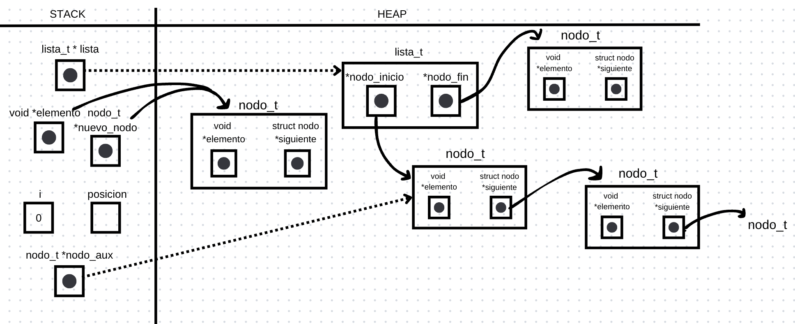
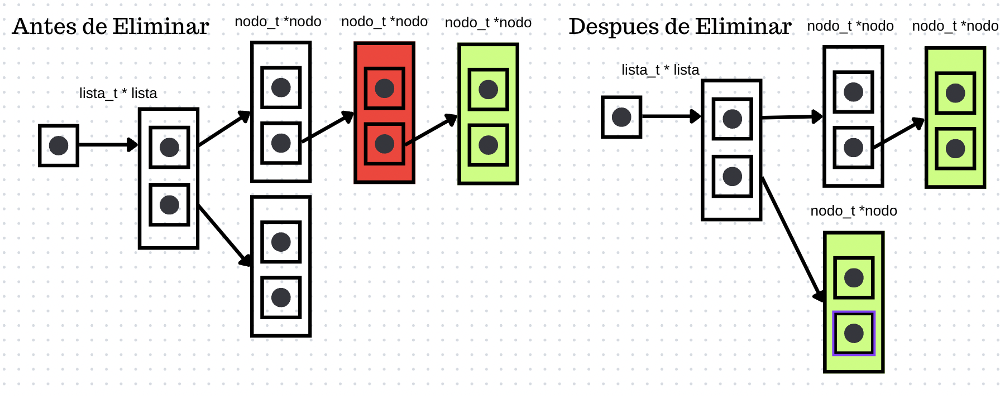
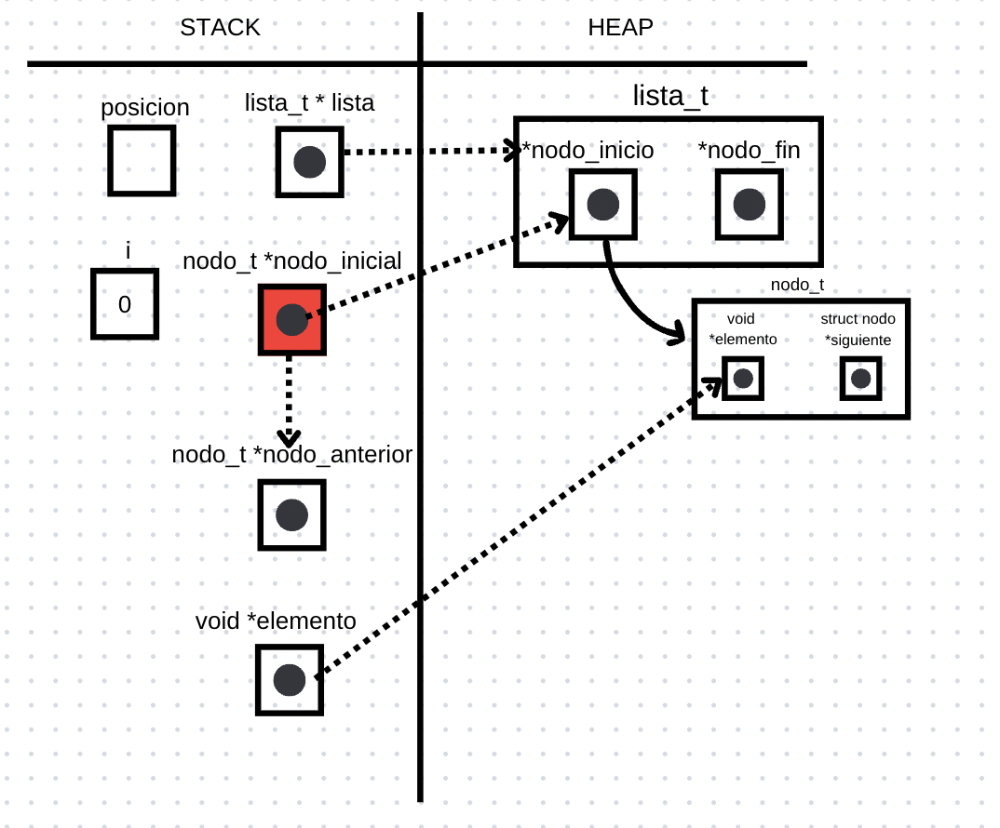

<div align="right">

</div>

# NOMBRE TP/TDA

## Repositorio de Renata Bruno - 106860 - rc.brunoo@gmail.com

- Para compilar:

```bash
gcc -o pruebas_alumno pruebas_alumno.c
```

- Para ejecutar:

```bash
./pruebas_alumno 
```

- Para ejecutar con valgrind:
```bash
valgrind ./pruebas_alumno 
```
---
##  Funcionamiento

<h4>lista_insertar</h4>
 Si la lista es NULL, es decir que no fue inicializada, devuelve NULL, si no se crea un nuevo nodo, reservando la memoria necesaria para él y se inserta al final de la lista. Si la lista estaba vacía, el nuevo nodo se convierte en el nodo de inicio y fin. Si la lista ya tenía nodos, el nodo final actual apunta al nuevo nodo, y el nuevo nodo se convierte en el nodo final.

<div align="center">

</div>

---

<h4>lista_insertar_en_posicion</h4>
Recibe una lista, una posicion y un elemento. Si la lista no es valida o es NULL, es decir que no fue inicializada, devuelve NULL. Si no se crea un nuevo nodo, reservando la memoria necesaria para él. 
Si la posición especificada es 0 o la lista está vacía, el nuevo nodo se inserta al principio de la lista. El puntero siguiente del nuevo nodo apunta al nodo de inicio actual, y el nuevo nodo se convierte en el nodo de inicio de la lista. Si la lista estaba vacía, el nuevo nodo también se convierte en el nodo final. 

En caso de que eso no ocurra y se decida insertar en una posicion, utilizamos el puntero nodo_ant para guardar en stack el nodo anterior a la posición de inserción. Una vez que se ha encontrado la posición correcta o se ha llegado al final de la lista, el puntero siguiente del nuevo nodo apunta al nodo siguiente del nodo anterior (nodo_ant). Luego, el puntero siguiente del nodo anterior apunta al nuevo nodo, insertando efectivamente el nuevo nodo en la posición correcta. Ademas, si el nuevo nodo era el último nodo de la lista, se actualiza el puntero nodo_fin de la lista para que apunte al nuevo nodo.

<div align="center">

</div>

<h4>lista_quitar_de_posicion</h4>
Recibe una lista y una posicion. Si la lista no es valida o es NULL, es decir que no fue inicializada, devuelve NULL. 

Utilizamos el puntero elemento para guardar en el stack el nodo a quitar, el puntero nodo_inicial para el nodo actual en la iteración y el puntero nodo_anterior para guardar el nodo anterior al nodo actual. Luego avanzamos en la lista hasta llegar a la posición de la lista que queremos quitar, se ajusta el puntero siguiente del nodo anterior para que apunte al nodo siguiente al nodo que se va a quitar. Luego, se libera la memoria del nodo quitado.

Si el nodo a quitar es el primer nodo de la lista, se ajusta el puntero nodo_inicio de la lista para que apunte al siguiente nodo. Si la lista queda vacía después de quitar el nodo, se actualiza el puntero nodo_fin a NULL. Luego, se libera la memoria del nodo quitado.

Si el nodo a quitar es el último nodo de la lista, se actualiza el puntero nodo_fin de la lista para que apunte al nodo anterior y se establece el puntero siguiente del nodo anterior a NULL. Luego, se libera la memoria del nodo quitado.

<div align="center">

</div>

<div align="center">

</div>

## Respuestas a las preguntas teóricas
- ¿Qué es una lista/pila/cola? </br>
Una lista es una estructura de datos que permite almacenar datos de manera secuencial. Cada elemento de la lista tiene un dato y un puntero al siguiente elemento de la lista. </br>

Una pila es una estructura de datos que permite almacenar datos de manera secuencial. Cada elemento de la pila tiene un dato y un puntero al siguiente elemento de la pila. La diferencia con la lista es que la pila solo permite agregar y quitar elementos por el mismo extremo, el tope de la pila. </br>

Una cola es una estructura de datos que permite almacenar datos de manera secuencial. Cada elemento de la cola tiene un dato y un puntero al siguiente elemento de la cola. La diferencia con la lista es que la cola solo permite agregar elementos por un extremo, el final de la cola, y quitar elementos por el otro extremo, el principio de la cola.


